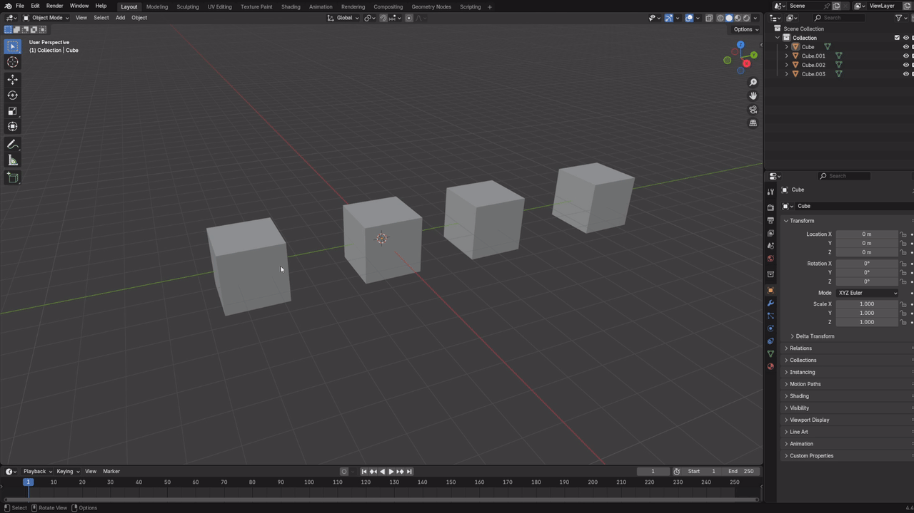

# Stack Hide and Reveal for Blender

Blender does not have a way to reveal only the last hidden object(s). Pressing H will hide selected objects, but Alt-H reveals all hidden objects. This can be quite 
troublesome. If this is also a problem for you, this add-on may provide a fix. After installing this add-on, you may: 

Hide objects as usual with H.

Press Alt-H to reveal hidden objects in reverse order of when they were hidden. Each press steps back one hide action. 

For example, if objects **A** and **B** were selected and hidden together, and 
object C is hidden afteward, the first Alt-H reveals object **C** first. Pressing Alt-H again then reveals both objects A and B.

If there is no hide history to step through (such as after restarting Blender), Alt-H reveals all currently hidden objects, the default 
behavior.

**This behavior change of H/Alt-H only applies in object mode. In other words, this will not work in edit mode or pose mode.**

To remain as non-intrusive as possible, this add-on does not write any data to the .blend file. As a result, this add-on may become slightly out of sync (temporarily) 
with Blender. Consider the following scenario:

    1. H to hide an object
    2. Ctrl-Z to undo hide, or delete the object, or reveal the object manually using the Outliner.
    3. Alt-H to reveal last hidden

An error will be thrown, saying that one of the actions listed in *2.* has occured, and thus the object cannot be revealed. No action is taken, and you can continue pressing Alt-H 
as normal, but it potentially could be annoying to press Alt-H more than you expect.

(Nobody will hide an object, then delete, but it is a case to mention.)

An alternative script will be up eventually to better sync with Blender, but it will involve writing data into the .blend file and "polluting" it.

Here's a quick demo:

